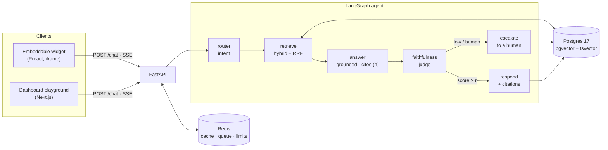

<div align="center">

# 🛎️ HelpDeck

### The AI support agent that refuses to make things up.

HelpDeck answers your customers **only** from your own knowledge base — with inline
source citations, deterministic anti‑hallucination guardrails, and automatic
hand‑off to a human when it isn't sure. Grounded RAG, streaming, multi‑tenant, and
embeddable on any site with a single `<script>` tag.

<br/>

[](https://github.com/imthi16/helpdeck/actions/workflows/ci.yml)
[](LICENSE)


</div>

---

## Why HelpDeck?

Most "AI support" bots are a thin wrapper around an LLM — so they confidently invent
refund policies, wrong prices, and features that don't exist. That's a liability, not a
feature.

HelpDeck is built the opposite way. Every answer is **grounded** in retrieved passages
from *your* documents, every claim carries a `[n]` citation you can click back to the
source, and a separate **faithfulness judge** checks the answer before it ships. If the
knowledge base can't support an answer, HelpDeck says so and escalates to a human —
**by design, it would rather hand off than hallucinate.**

> **Run it in ~5 minutes with zero API keys.** HelpDeck ships with a deterministic
> offline embedding + LLM fallback, so you can `docker compose up`, seed a demo
> knowledge base, and watch grounded answers stream — no OpenAI/Anthropic account
> required. Add keys later for production‑grade quality.

---

## What it actually does

```text
You:  How often should I descale the machine?
Bot:  Descale the machine every three months with normal use and medium-hardness
      water. [1]
      └─ [1] descaling.md — "Descale the machine every three months…"   (click to view source)

You:  What is your CEO's shoe size?
Bot:  I don't have enough information to answer that.
      ⚠︎ Connecting you with a member of our support team — they'll follow up shortly.
      └─ escalation recorded · no citation invented
```

That refusal is the whole point. The grounded‑prompt contract is inviolable: answer only
from numbered context, cite `[n]`, otherwise say you don't know and escalate.

---

## Features

| | |
|---|---|
| 🔎 **Hybrid retrieval** | Dense vectors (pgvector HNSW) **+** BM25‑style full‑text (`tsvector`) fused with Reciprocal Rank Fusion, plus an optional Cohere reranker. |
| 📚 **Grounded, cited answers** | Answers only from retrieved chunks; fabricated `[n]` citations are structurally dropped before they reach the user. |
| 🛡️ **Guardrails** | A cheap LLM‑as‑judge scores faithfulness; low‑confidence or ungrounded answers escalate instead of guessing. |
| 🙋 **Human escalation** | "Talk to a human", out‑of‑scope questions, and low confidence all create an escalation the team can resolve and reply to. |
| ⚡ **Real streaming** | Server‑Sent Events stream `status → token → citation → done`, with a live debug panel (retrieved chunks, scores, model, latency, tokens). |
| 🏢 **Multi‑tenant** | Every tenant row is `org_id`‑scoped; per‑org public widget keys, Origin allow‑lists, and Redis rate limiting. |
| 🧩 **Embeddable widget** | One `<script>` tag → a ~1 KB loader injects an isolated iframe chat. Host‑CSS‑proof, lazy‑loaded, `window.HelpDeck` API. |
| 🗂️ **Ingestion pipeline** | PDF / URL / raw text → heading‑aware chunking → batched embeddings → background `arq` jobs, with live status in the dashboard. |
| 🧮 **Response cache** | Redis exact‑match cache keyed on `(org, query, kb_version)` — re‑ingesting the KB invalidates stale answers automatically. |

---

## Architecture



**Ingestion** (background `arq` jobs): `upload / crawl → extract → heading‑aware chunk
(500–800 tokens, ~12% overlap) → batched embed → upsert chunks (vector + tsvector)`.

<table>
<tr><td><b>Backend</b></td><td>Python 3.12 · FastAPI (async) · SQLAlchemy 2 + Alembic · Pydantic v2 · <code>uv</code></td></tr>
<tr><td><b>Agent</b></td><td>LangGraph 1.x with a Postgres checkpointer · provider‑agnostic LLM gateway (litellm)</td></tr>
<tr><td><b>Data</b></td><td>Postgres 17 + pgvector (HNSW) + full‑text <code>tsvector</code> (GIN) · Redis 7 · <code>arq</code> jobs</td></tr>
<tr><td><b>Retrieval</b></td><td>Hybrid dense + BM25‑style full‑text → Reciprocal Rank Fusion → optional reranker</td></tr>
<tr><td><b>Frontend</b></td><td>Next.js 16 App Router · TypeScript strict · Tailwind · shadcn/ui · <code>pnpm</code></td></tr>
<tr><td><b>Widget</b></td><td>Preact + Vite · ~1 KB gzipped loader · isolated iframe app</td></tr>
<tr><td><b>Streaming</b></td><td>Server‑Sent Events via <code>sse-starlette</code></td></tr>
</table>

---

## Quickstart

> Prerequisites: **Docker**, **[uv](https://docs.astral.sh/uv/)**, **Node 20+** with
> **pnpm** (`corepack enable pnpm`). No LLM API keys needed for the demo.

**1 — Start Postgres + Redis**

```bash
docker compose -f infra/docker-compose.yml up -d      # pgvector/pg17 + redis:7
```

> The app's defaults already point at this stack (Postgres `:5433`, Redis `:6380`), so no
> config is needed for the demo. Copy `.env.example` → `apps/api/.env` only when you're
> ready to add API keys.

**2 — Run the API + worker, then seed a demo knowledge base**

```bash
cd apps/api
uv sync
uv run alembic upgrade head
uv run python scripts/seed.py                          # ingests the Northwind Coffee corpus
uv run uvicorn app.main:app --reload --port 8000       # API  → http://localhost:8000
uv run arq app.workers.main.WorkerSettings             # (separate shell) ingestion worker
```

**3 — Run the dashboard**

```bash
cd apps/web
pnpm install
NEXT_PUBLIC_API_URL=http://localhost:8000 pnpm dev     # → http://localhost:3000
```

Sign up, breeze through onboarding, upload a doc, and ask a question in the **Playground** —
you'll see the answer stream in with citations and a debug panel of the retrieved chunks.

**4 — Try the embeddable widget**

```bash
cd apps/widget
pnpm install && pnpm build                             # → dist/helpdeck.js (~1 KB gz) + dist/app
open examples/demo.html                                # a plain HTML page with the launcher bubble
```

<details>
<summary><b>Production quality (optional):</b> add real models</summary>

Set these in `.env` and HelpDeck automatically uses them instead of the offline fallbacks:

```bash
OPENAI_API_KEY=sk-...          # embeddings (text-embedding-3-small, 1536 dims)
ANTHROPIC_API_KEY=sk-ant-...   # router / answer / judge via the litellm gateway
LLM_CHEAP_MODEL=claude-haiku-4-5-20251001
LLM_STRONG_MODEL=claude-sonnet-5
RERANKER=cohere                # optional; needs COHERE_API_KEY
```
</details>

---

## Repository layout

```
apps/api/      FastAPI app — core, models, schemas, routers, services, agent, workers + tests + alembic
apps/web/      Next.js 16 dashboard — auth, knowledge base, playground, conversations, onboarding
apps/widget/   Embeddable widget — tiny loader + Preact iframe chat app
eval/          Golden corpus & retrieval fixtures (RAGAS harness planned)
infra/         docker-compose (pgvector + redis)
docs/          IMPLEMENTATION_PLAN.md and notes
```

## Tested & CI

Green on every push — **94 backend tests** (`pytest`) plus **19 browser E2E tests**
(Playwright) across the dashboard and the widget, including the full *signup → upload →
grounded cited answer* and *widget → out‑of‑KB → escalation* journeys.

```bash
cd apps/api  && uv run pytest -q                       # backend
cd apps/web  && pnpm exec playwright test              # dashboard E2E
cd apps/widget && pnpm exec playwright test            # widget E2E
```

A quick offline retrieval sanity check: **9 / 10** hand‑written questions surface the
expected chunk in the top‑3 using only the built‑in offline embedder (real embeddings do
better).

---

## Roadmap

HelpDeck is built phase‑by‑phase from an [implementation plan](docs/IMPLEMENTATION_PLAN.md).

- ✅ **Phase 0** — Monorepo scaffold & CI
- ✅ **Phase 1** — Ingestion & hybrid retrieval
- ✅ **Phase 2** — LangGraph agent, guardrails & SSE streaming
- ✅ **Phase 3** — Dashboard MVP (auth, KB, playground, conversations, onboarding)
- ✅ **Phase 4** — Embeddable widget · **← sellable MVP**
- 🔜 **Phase 5** — Row‑Level Security, RBAC, API keys, audit log, analytics
- 🔜 **Phase 6** — Langfuse tracing & RAGAS evaluation gated in CI
- 🔜 **Phase 7** — Production deploy & public demo

## License

[MIT](LICENSE) © Mohamed Imthiyas M
