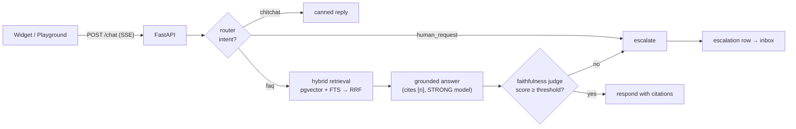

# HelpDeck Architecture

A multi-tenant, grounded-RAG customer support agent. Monorepo: FastAPI
backend (`apps/api`), Next.js dashboard (`apps/web`), embeddable Preact
widget (`apps/widget`), evaluation suite (`eval/`).

## The chat turn

Every LLM/embedding call goes through `app/services/llm.py` /
`app/services/embeddings.py` (provider-agnostic via litellm; local Ollama by
default, hosted Anthropic/OpenAI by key) and is Langfuse-traced. The turn is
one `chat.turn` trace with per-node spans; conversations map to Langfuse
sessions.

## Ingestion

upload/crawl → extract (`pypdf`/`trafilatura`/passthrough) → heading-aware
chunking (500–800 tokens, 10–15 % overlap, never mid-sentence) → batched
embeddings → upsert `chunks` (vector + generated tsvector). Runs as `arq`
jobs; `documents.status` tracks the lifecycle.

## Multi-tenancy (defense in depth)

1. **Postgres RLS (FORCE)** on every tenant table, keyed on the
   transaction-local `app.current_tenant` setting; the API serves requests as
   the non-superuser `helpdeck_app` role. Composite `(id, org_id)` FKs stop
   cross-tenant child references (FK checks bypass RLS).
2. **Explicit `org_id` scoping** in every query, kept even though RLS exists.
3. **RBAC** (owner > admin > agent > viewer) enforced by `require_role`
   dependencies; org selection via membership (+ optional `X-Org-Id`).
4. Identity tables (`users`, `organizations`, `memberships`, `invitations`)
   are deliberately *not* RLS'd — their lookups happen before a tenant is
   known — and are reachable only through centralized query paths.
5. Widget requests authenticate with a revocable `api_keys` row resolved via
   a `SECURITY DEFINER` function (pre-tenant lookup), then run tenant-scoped.
6. `audit_logs` is append-only: the app role can only SELECT (org-scoped
   policy); writes go through a `SECURITY DEFINER` insert function; a trigger
   blocks UPDATE/DELETE even for the table owner.

## Quality loop

- **Golden dataset** (`eval/golden.jsonl`, 125 hand-written items, 16 % of
  them deliberately unanswerable) over the fictional Northwind corpus.
- **Runner** (`eval/run_eval.py`) exercises the real pipeline in-process:
  deterministic metrics (context recall/precision, refusal accuracy,
  citation validity) always; RAGAS faithfulness/answer-relevancy with a
  local judge on demand.
- **CI gate** on PRs touching agent/retrieval code; nightly full run;
  nightly online sampling re-judges production answers and alerts on a
  7-day regression.

## Key decisions (ADRs)

- [ADR-001: pgvector over a dedicated vector DB](adr/001-pgvector-over-dedicated-vector-db.md)
- [ADR-002: SSE over WebSockets](adr/002-sse-over-websockets.md)
- [ADR-003: Postgres RLS for multi-tenancy](adr/003-postgres-rls-multi-tenancy.md)
